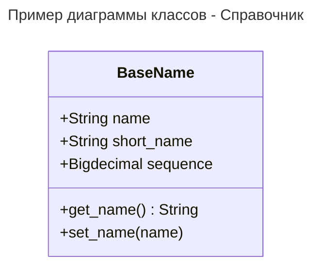

```mermaid
---
title: Пример диаграммы класcов - Справочник
---
classDiagram
    class BaseName
    BaseName : +String name
    BaseName : +String short_name
    BaseName : +Bigdecimal sequence
    BaseName : +get_name() String
    BaseName : +set_name(name)


```
