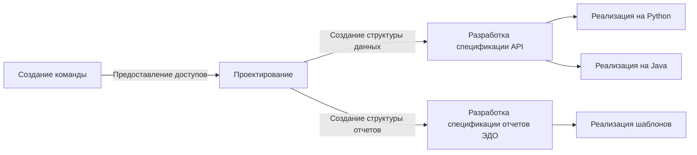

```mermaid
flowchart LR

A[Создание команды] --> | Предоставление доступов | B[Проектирование]
B --> |Создание структуры данных| C[Разработка спецификации API]
C --> D[Реализация на Python]
C --> E[Реализация на Java]
B --> |Создание структуры отчетов| F[Разработка спецификации отчетов ЭДО]
F --> G[Реализация шаблонов]
```
