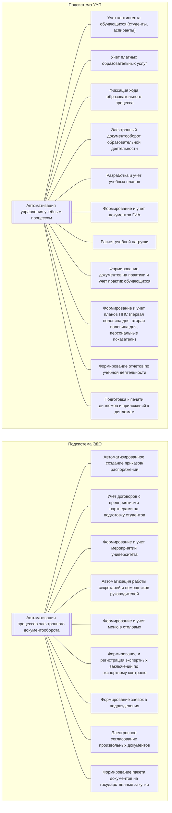

```mermaid
flowchart LR

subgraph Подсистема ЭДО
direction LR
A1[[Автоматизация процессов электронного документооборота]] --- A11[Автоматизированное создание приказов/распоряжений]
A1 --- A12[Учет договоров с предприятиями партнерами на подготовку студентов]
A1 --- A13[Формирование и учет мероприятий университета]
A1 --- A14[Автоматизация работы секретарей и помощников руководителей]
A1 --- A15[Формирование и учет меню в столовых]
A1 --- A16[Формирование и регистрация экспертных заключений по экспортному контролю]
A1 --- A17[Формирование заявок в подразделения]
A1 --- A18[Электронное согласование произвольных документов]
A1 --- A19[Формирование пакета документов на государственные закупки]
end 

subgraph Подсистема УУП
direction LR
A2[[Автоматизация управления учебным процессом]] --- A21["Учет контингента обучающихся (студенты, аспиранты)"]
A2 --- A22[Учет платных образовательных услуг]
A2 --- A23[Фиксация хода образовательного процесса]
A2 --- A24[Электронный документооборот образовательной деятельности]
A2 --- A25[Разработка и учет учебных планов]
A2 --- A26[Формирование и учет документов ГИА]
A2 --- A27[Расчет учебной нагрузки]
A2 --- A28[Формирование документов на практики и учет практик обучающихся]
A2 --- A29["Формирование и учет планов ППС (первая половина дня, вторая половина дня, персональные показатели)"]
A2 --- A210[Формирование отчетов по учебной деятельности]
A2 --- A211[Подготовка к печати дипломов и приложений к дипломам]
end

```
