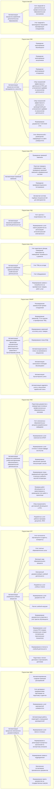

```mermaid
flowchart LR

subgraph Подсистема ЭДО
direction LR
A1[[Автоматизация процессов электронного документооборота]] --- A11[Автоматизированное создание приказов/распоряжений]
A1 --- A12[Учет договоров с предприятиями партнерами на подготовку студентов]
A1 --- A13[Формирование и учет мероприятий университета]
A1 --- A14[Автоматизация работы секретарей и помощников руководителей]
A1 --- A15[Формирование и учет меню в столовых]
A1 --- A16[Формирование и регистрация экспертных заключений по экспортному контролю]
A1 --- A17[Формирование заявок в подразделения]
A1 --- A18[Электронное согласование произвольных документов]
A1 --- A19[Формирование пакета документов на государственные закупки]
end 

subgraph Подсистема УУП
direction LR
A2[[Автоматизация управления учебным процессом]] --- A21["Учет контингента обучающихся (студенты, аспиранты)"]
A2 --- A22[Учет платных образовательных услуг]
A2 --- A23[Фиксация хода образовательного процесса]
A2 --- A24[Электронный документооборот учебной деятельности]
A2 --- A25[Разработка и учет учебных планов]
A2 --- A26[Формирование и учет документов ГИА]
A2 --- A27[Расчет учебной нагрузки]
A2 --- A28[Формирование документов на практики и учет практик обучающихся]
A2 --- A29["Формирование и учет планов ППС (первая половина дня, вторая половина дня, персональные показатели)"]
A2 --- A210[Формирование отчетов по учебной деятельности]
A2 --- A211[Подготовка к печати дипломов и приложений к дипломам]
end

subgraph Подсистема УМО
direction LR
A3[[Автоматизация процессов управления учебно-методическим обеспечением и образовательной деятельностью]] --- A31[Подготовка документов к аккредитации основных профессиональных образовательных программ]
A3 --- A32[Учет электронных образовательных ресурсов разработанных кафедрами]
A3 --- A33[Формирование и учет компонентов ОПОП]
A3 --- A34[Формирование и учет отчетов и планов кафедр/институтов]
A3 --- A35[Формирование расписания занятий, консультаций, сессии]
A3 --- A36[Формирование плана редакционной подготовки и выпуска учебной и научной литературы]
A3 --- A37[Проверка работ обучающихся на заимствования и размещение этих работ в хранилище]
A3 --- A38[Сбор показателей и достижений обучающихся и ППС]
A3 --- A39[Разработка и учет рабочих программ дисциплин, ФОС]
end

subgraph Подсистема УЭФИР
direction LR
A4[[Автоматизация процессов управления финансово-экономической деятельностью,  инвестиционным развитием и бухгалтерским учетом]] --- A41[Распределение ежемесячной премии сотрудникам]
A4 --- A42[Формирование заявлений, ТЗ на закупки и приобретение ТМЦ]
A4 --- A43[Формирование заявлений на оплату услуг, товаров]
A4 --- A44[Формирование плана ФХД]
A4 --- A45[Автоматизация расчета платы за проживание в общежитиях]
A4 --- A46[Автоматизация начисления стипендии обучающимся]
A4 --- A47[Автоматизация бухгалтерского учета]
A4 --- A48[Автоматизация кадрового учета и начисления заработной платы]
end

subgraph Подсистема АХД
direction LR
A5[[Автоматизация процессов управления административно-хозяйственной деятельностью]] --- A51[Учет аудиторного фонда, помещений, характеристик помещений, потребности в ремонте]
A5 --- A52[Учет ТМЦ на складе]
A5 --- A53[Учет оборудования]
A5 --- A54[Формирование заявок о потребностях на приобретение товаров, работ, услуг]
end

subgraph Подсистема УНД
direction LR
A6[[Автоматизация процессов управления научной деятельностью]] --- A61[Учет грантов и хоздоговорных тем]
A6 --- A62[Формирование и учет пакета документов на регистрацию интеллектуальной собственности]
end

subgraph Подсистема УПК
direction LR
A7[[Автоматизация приемной кампании]] --- A71[Проведение приемной кампании]
A7 --- A72[Пакетная передача информации о ходе проведения приемной кампании в федеральные системы]
A7 --- A73[Проведение профориентационного тестирования]
A7 --- A74[Экспертная система подбора специальностей для абитуриентов]
end

subgraph Подсистема СМК
direction LR
A8[[Автоматизация процессов системы менеджмента и качества]] --- A81[Проведение анкетирования обучающихся]
A8 --- A82[Проведение анкетирования выпускников]
A8 --- A83[Проведение анкетирования сотрудников]
A8 --- A84[Сбор показателей эффективности деятельности ППС для установления надбавки по результатам деятельности]
A8 --- A85[Сбор показателей эффективности деятельности руководителей для установления надбавки по результатам деятельности]
A8 --- A86[Формирование документов 7.5.04-2019 СТО]
A8 --- A87[Учет обязательной к размещению информации на сайте университета]
end

subgraph Подсистема ДО
direction LR
A9[[Автоматизация процессов управления дополнительным образованием]] --- A91[Учет сведений по дополнительным профессиональным образовательным программам]
A9 --- A92[Учет сведений о прохождении повышения квалификации сотрудниками]
end

```
