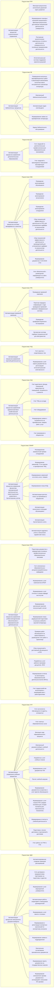

```mermaid
flowchart LR

subgraph Подсистема ЭДО
direction LR
A01[[Автоматизация процессов электронного документооборота]]
A01 --- A01_1[Автоматизированное создание приказов/распоряжений]
A01 --- A01_2[Учет договоров с предприятиями партнерами на подготовку студентов]
A01 --- A01_3[Формирование и учет мероприятий университета]
A01 --- A01_4[Автоматизация работы секретарей и помощников руководителей]
A01 --- A01_5[Формирование и учет меню в столовых]
A01 --- A01_6[Формирование и регистрация экспертных заключений по экспортному контролю]
A01 --- A01_7[Формирование заявок в подразделения]
A01 --- A01_8[Электронное согласование произвольных документов]
A01 --- A01_9[Формирование пакета документов на государственные закупки]
A01 --- A01_10[Формирование электронного архива документов с интеграцией с внешними ИС архивов]
end 

subgraph Подсистема УУП
direction LR
A02[[Автоматизация управления учебным процессом]] 
A02 --- A02_1["Учет контингента обучающихся (студенты, аспиранты)"]
A02 --- A02_02[Учет платных образовательных услуг]
A02 --- A02_03[Фиксация хода образовательного процесса]
A02 --- A02_04[Электронный документооборот учебной деятельности]
A02 --- A02_05[Разработка и учет учебных планов]
A02 --- A02_06[Формирование и учет документов ГИА]
A02 --- A02_07[Расчет учебной нагрузки]
A02 --- A02_08[Формирование документов на практики и учет практик обучающихся]
A02 --- A02_09["Формирование и учет планов ППС (первая половина дня, вторая половина дня, персональные показатели)"]
A02 --- A02_10[Формирование отчетов по учебной деятельности]
A02 --- A02_11[Подготовка к печати дипломов и приложений к дипломам]
A02 --- A02_12[Учет работы по ПЧФ и ГПХ]
end

subgraph Подсистема УМО
direction LR
A03[[Автоматизация процессов управления учебно-методическим обеспечением и образовательной деятельностью]]
A03 --- A03_01[Подготовка документов к аккредитации основных профессиональных образовательных программ]
A03 --- A03_02[Учет электронных образовательных ресурсов разработанных кафедрами]
A03 --- A03_03[Формирование и учет компонентов ОПОП]
A03 --- A03_04[Формирование и учет отчетов и планов кафедр/институтов]
A03 --- A03_05[Формирование расписания занятий, консультаций, сессии]
A03 --- A03_06[Формирование плана редакционной подготовки и выпуска учебной и научной литературы]
A03 --- A03_07[Проверка работ обучающихся на заимствования и размещение этих работ в хранилище]
A03 --- A03_08[Сбор показателей и достижений обучающихся и ППС]
A03 --- A03_09[Разработка и учет рабочих программ дисциплин, ФОС]
A03 --- A03_10["Формирование отчётов по мониторингу образовательной деятельности(типо ВПО1)"]
A03 --- A03_11[Учет трудоустройства выпускников и взаимодействия с работодателями]
end

subgraph Подсистема УЭФИР
direction LR
A04[[Автоматизация процессов управления финансово-экономической деятельностью, инвестиционным развитием и бухгалтерским учетом]]
A04 --- A04_01[Распределение ежемесячной премии сотрудникам]
A04 --- A04_02[Формирование заявлений, ТЗ на закупки и приобретение ТМЦ]
A04 --- A04_03[Формирование заявлений на оплату услуг, товаров]
A04 --- A04_04[Формирование плана ФХД]
A04 --- A04_05[Автоматизация расчета платы за проживание в общежитиях]
A04 --- A04_06[Автоматизация начисления стипендии обучающимся]
A04 --- A04_07[Автоматизация бухгалтерского учета]
A04 --- A04_08[Автоматизация кадрового учета и начисления заработной платы]
end

subgraph Подсистема АХД
direction LR
A05[[Автоматизация процессов управления административно-хозяйственной деятельностью]]
A05 --- A05_01[Учет аудиторного фонда, помещений, характеристик помещений, потребности в ремонте]
A05 --- A05_02[Учет ТМЦ на складе]
A05 --- A05_03[Учет оборудования]
A05 --- A05_04[Формирование заявок о потребностях на приобретение товаров, работ, услуг]
A05 --- A05_05[Учет проживания в общежитиях]
end

subgraph Подсистема УНД
direction LR
A06[[Автоматизация процессов управления научной деятельностью]]
A06 --- A06_01[Учет грантов и хоздоговорных тем]
A06 --- A06_02[Формирование и учет пакета документов на регистрацию интеллектуальной собственности]
end

subgraph Подсистема УПК
direction LR
A07[[Автоматизация приемной кампании]]
A07 --- A07_01[Проведение приемной кампании]
A07 --- A07_02[Пакетная передача информации о ходе проведения приемной кампании в федеральные системы]
A07 --- A07_03[Проведение профориентационного тестирования]
A07 --- A07_04[Экспертная система подбора специальностей для абитуриентов]
end

subgraph Подсистема СМК
direction LR
A08[[Автоматизация процессов системы менеджмента и качества]]
A08 --- A08_01[Проведение анкетирования обучающихся]
A08 --- A08_02[Проведение анкетирования выпускников]
A08 --- A08_03[Проведение анкетирования сотрудников]
A08 --- A08_04[Сбор показателей эффективности деятельности ППС для установления надбавки по результатам деятельности]
A08 --- A08_05[Сбор показателей эффективности деятельности руководителей для установления надбавки по результатам деятельности]
A08 --- A08_06[Формирование документов 7.5.04-2019 СТО]
A08 --- A08_07[Учет обязательной к размещению информации на сайте университета]
end

subgraph Подсистема ДО
direction LR
A09[[Автоматизация процессов управления дополнительным образованием]]
A09 --- A09_01[Учет сведений по дополнительным профессиональным образовательным программам]
A09 --- A09_02[Учет сведений о прохождении повышения квалификации сотрудниками]
end

subgraph Подсистема ЭБ
direction LR
A10[[Автоматизация библиотечных процессов]]
A10 --- A10_01[Размещение выпускных квалификационных работ и реализация механизмов полнотекстового постраничного просмотра литературы]
A10 --- A10_02[Электронный библиотечный каталог]
A10 --- A10_03[Автоматизация задач книговыдачи]
A10 --- A10_04[Формирование заявок на приобретение литературы]
A10 --- A10_05[Задачи библиотечного обслуживания]
end

subgraph Подсистема ППР
direction LR
A11[[Автоматизация процессов стратегического управления]]
A11 --- A11_01[Фиксация результатов исполнения дорожной карты развития]
A11 --- A11_02[Формирование плановых значений показателей и фиксация результатов достижения показателей деятельности университета]
A11 --- A11_03[Построение аналитических комплексных отчетов о деятельности университета по основным направлениям деятельности]
A11 --- A11_04[Интеллектуальная система поддержки принятия решений]
end

```
